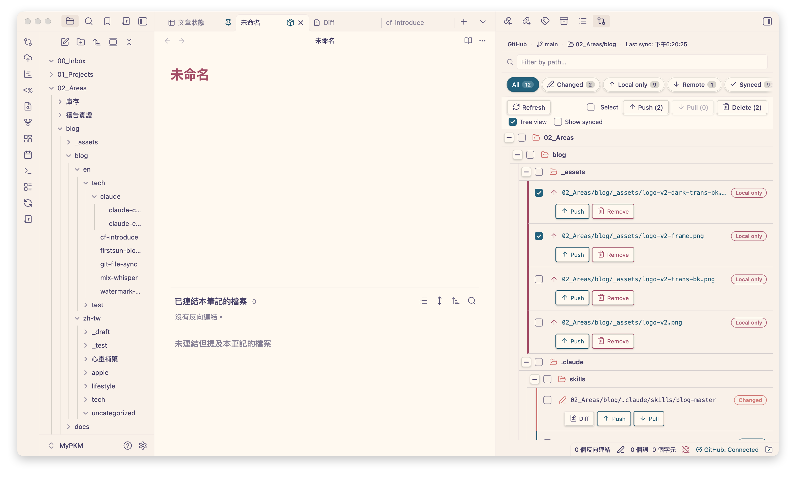
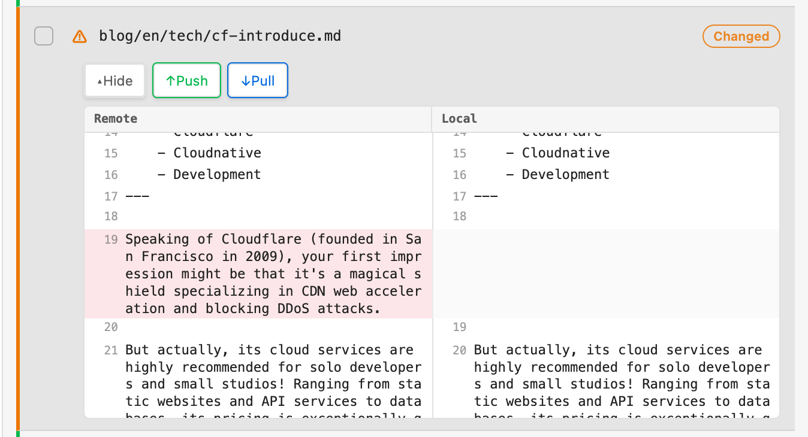
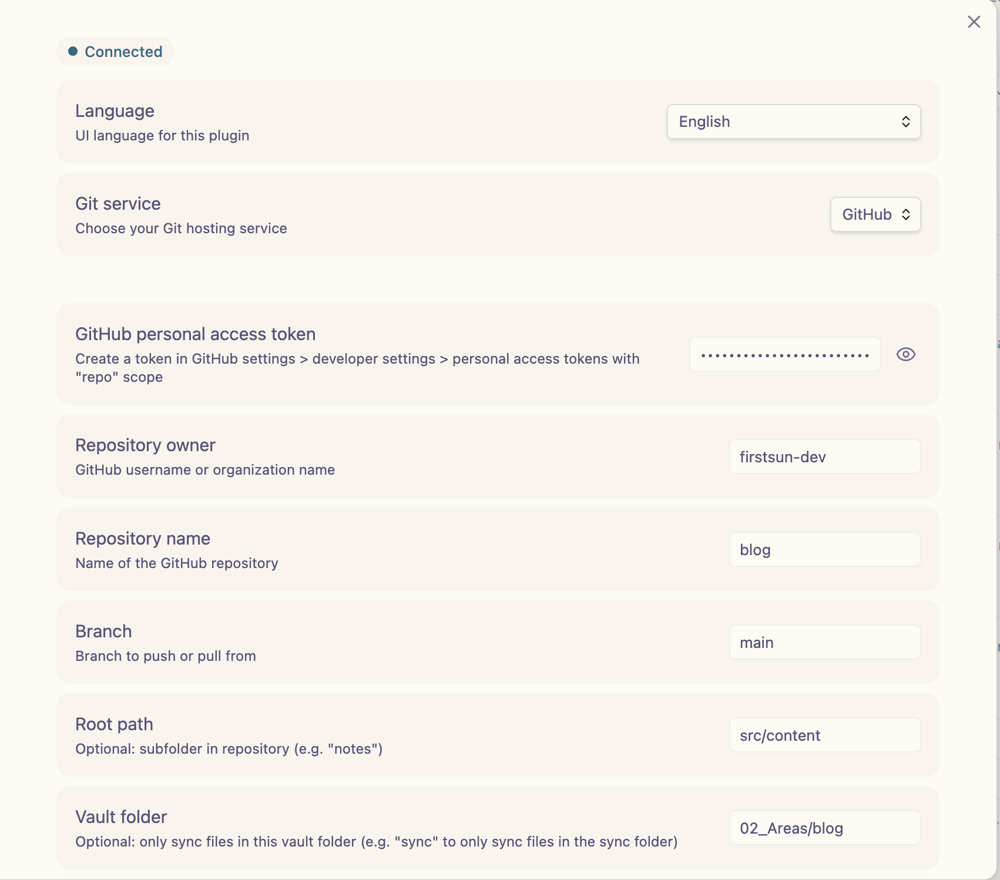

<div align="center">

# Git File Sync
*Selective, file-by-file sync between your vault and GitHub, GitLab, or Gitea.*

[](https://github.com/firstsun-dev/git-files-sync/actions/workflows/ci.yml)
[](https://github.com/firstsun-dev/git-files-sync/releases)
[](https://obsidian.md/plugins?id=git-file-sync)
[](LICENSE)

**[Releases](https://github.com/firstsun-dev/git-files-sync/releases)** · **[繁體中文](USAGE_zh.md)** · **[简体中文](USAGE_zh-cn.md)** · **[Changelog](CHANGELOG.md)**

</div>

Push, pull, diff, and resolve conflicts — file by file, not whole-vault. Unlike full-vault sync solutions, Git File Sync gives you granular control over exactly what leaves your device, so you can keep personal notes private while sharing project files through a real Git repository.

  

<video src="https://blog-assets.firstsun.org/obsidian/plugins/git-file-sync/git-file-sync-en.webm" autoplay loop muted playsinline width="600"></video>


*The Sync Status View gives a bird's-eye view of your vault, letting you selectively push, pull, or diff modified files.*

## What's inside

- **File-by-file control** — Sync individual notes or selected files from a folder, not your entire vault. No lock-in to a single sync provider for everything.
- **Three Git providers** — GitHub, GitLab (including self-hosted), and Gitea, all behind one consistent UI.
- **Review before applying** — Every push, pull, and remote deletion shows a plan of additions, changes, moves, and deletions before it writes anything.
- **Real rename support** — Renamed files and moved folders are committed as moves, without leaving duplicate files behind remotely.
- **Visual diffing** — A built-in diff viewer compares local and remote versions before anything is overwritten; on desktop it opens in a dedicated pane.
- **Conflict resolution** — When local and remote both changed, resolve manually with a dedicated conflict tool instead of guessing which version wins.
- **Works on mobile** — Full support for Obsidian Mobile with a touch-friendly sync dashboard; the inline diff remains available there.
- **Three interface languages** — English, Traditional Chinese, and Simplified Chinese. Follow Obsidian's display language or choose one in Settings.

## Sync Status View

A single dashboard shows the state of every tracked file:

- **Live status and startup refresh** — tracked files update as you edit or rename them, and the view refreshes automatically after Obsidian starts (configurable in Settings).
- **Status filtering and search** — instantly narrow the list to modified, new, remote-only, moved, or matching paths.
- **Tree view and folder selection** — optionally browse files as a collapsible hierarchy, select folders with tri-state checkboxes, and choose whether synced files appear in All.
- **Safe moves** — renamed files appear as **Moved**; related folder moves collapse into one row and can be pushed or reverted together.
- **Visual diffs** — line-by-line comparison of local vs. remote before syncing; click a path to open the local note or its remote page when available.
- **Remote-only detection** — spot files that exist on GitHub/GitLab/Gitea but haven't been pulled into the vault yet.


*The built-in diff viewer compares local and remote changes before you push or pull.*

## Providers

| Provider | Hosting | Min. version |
|---|---|---|
|  | github.com · GitHub Enterprise | — |
|  | gitlab.com · self-hosted | GitLab 13.0+ |
|  | self-hosted | Gitea 1.12+ |

> **Gitea note:** the plugin talks to the Gitea API v1 (`/api/v1`) and resolves branch names to commit SHAs before fetching the file tree, which is what makes 1.12+ the floor.

## Configuration


*Pick a provider and supply its credentials in Settings > Git File Sync.*

| | Provider | Required info | Token scope |
|:---:|---|---|---|
|  | **GitHub** | Personal access token, owner, repo name | `repo` |
|  | **GitLab** | Personal access token, project ID, base URL | `api` |
|  | **Gitea** | Personal access token, base URL, owner, repo name | (all) |

- **GitHub token:** Settings → Developer settings → Personal access tokens → `repo` scope.
- **GitLab token:** User settings → Access tokens → `api` scope. Base URL defaults to `https://gitlab.com`; change it for self-hosted instances.
- **Gitea token:** User settings → Applications → Access tokens. Point the base URL at your instance (e.g. `https://gitea.example.com`).

Other settings: **language** (system default, English, Traditional Chinese, or Simplified Chinese); **auto-refresh Sync Status on startup**; **branch** to sync against (default `main`); **root path** prefix inside the repo; **vault folder** to scope which notes are tracked; and **symbolic link handling** (*real* — recreate the link, GitHub only; *follow* — sync the target's content; *skip*). See [Symbolic link handling](docs/symlink-handling.md) for details.

## Daily workflow

**Pushing:**
- One note — the cloud icon in the ribbon, or the command `Push current file to GitLab/GitHub/Gitea`.
- Several notes — open the Sync Status View, filter to **Modified**, select files, click **Push selected**.
- From the file tree — right-click any file and choose `Push to GitLab/GitHub/Gitea`.
- Review the proposed changes in the plan, then choose **Apply**. Renames and folder moves are included as real moves.

**Pulling:**
1. Open the Sync Status View and click **Refresh status**.
2. Files with remote updates show as **Modified** or **Remote only**.
3. Select them and click **Pull selected**.
4. Review the plan and choose **Apply**. Pulling overwrites local changes — if both sides changed, the conflict tool opens instead.

**Resolving a conflict:**
1. The Conflict Resolution window opens automatically.
2. Left pane is your **Local** version, right pane is **Remote**.
3. Choose **Keep Local** (overwrite remote on next push) or **Keep Remote** (accept remote, overwrite local).

**On mobile:** swipe from the left to open the ribbon and the Sync Status View, pull before you start editing, push when you're done.

## Installation

### From Community Plugins (recommended)
1. Open **Settings > Community plugins** and turn off restricted mode.
2. Click **Browse**, search for **Git File Sync**, click **Install**, then **Enable**.

### Manual
1. Download `main.js`, `manifest.json`, and `styles.css` from the [latest release](https://github.com/firstsun-dev/git-files-sync/releases/latest).
2. Create `<vault>/.obsidian/plugins/git-file-sync/`.
3. Copy the three files into that folder.
4. Reload Obsidian and enable the plugin under **Settings > Community plugins**.

## Quick start

1. Configure a provider in **Settings > Git File Sync** (see [Configuration](#configuration)).
2. Open the **Sync Status View** — the list icon in the ribbon, or run `Open sync status view` from the Command Palette.
3. The view refreshes automatically after startup; click **Refresh status** whenever you want to check again.
4. Use the status tabs, path search, or optional tree view to find files; select files or folders and choose **Push selected** or **Pull selected**.
5. Review the sync plan, then choose **Apply**.

**Commands:**

| Command | What it does |
|---|---|
| Open sync status view | Open the sync dashboard |
| Push current file to GitLab/GitHub/Gitea | Push the active note |
| Pull current file to GitLab/GitHub/Gitea | Pull the active note |
| Push all files | Review and push every tracked, changed file |
| Pull all files | Review and pull every tracked, changed file |

## Privacy and security

- **Local storage** — personal access tokens are stored locally in the plugin's data folder inside your vault, and are only ever sent to the Git provider you configured.
- **No telemetry** — the plugin collects no usage data or analytics.

## Requirements

- Obsidian **1.13.0** or later
- Desktop and mobile supported

## Development

```bash
git clone https://github.com/firstsun-dev/git-files-sync.git
npm install

npm run dev    # watch build
npm run build  # type-check + production build
npm run test   # vitest suite
npm run lint   # eslint
```

## License

MIT

---

**Created by [ClaudiaFang](https://github.com/ClaudiaFang)**
