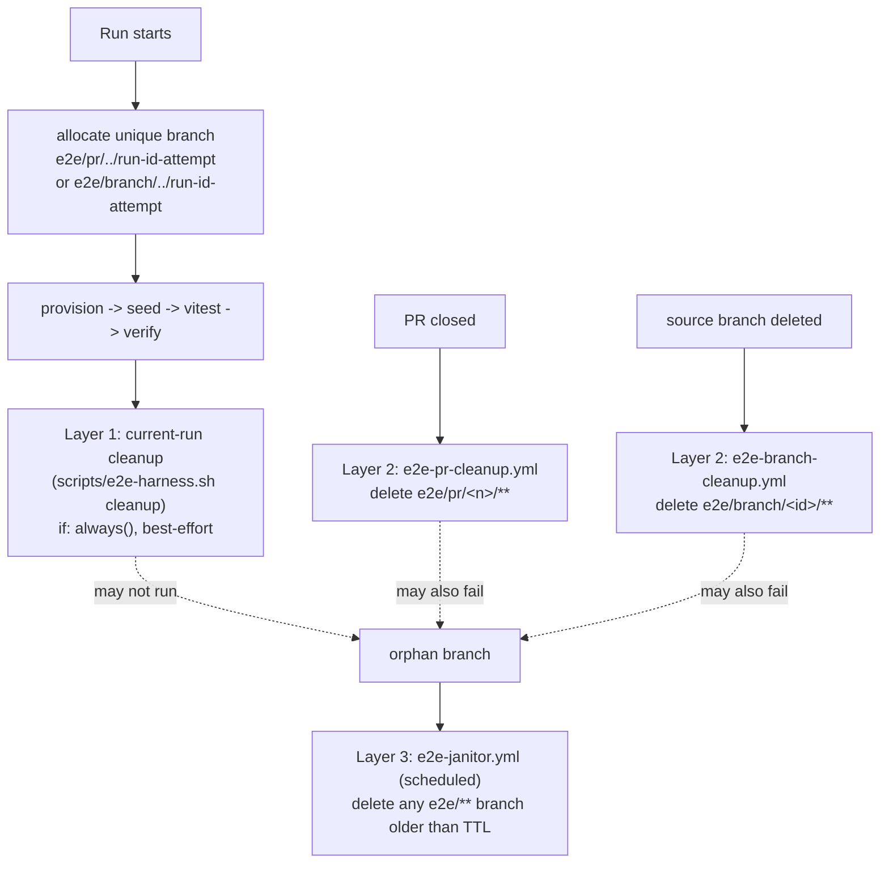

# Real-provider E2E

Issue #57. Real `SyncManager`/`GitHubService`/`GitLabService`/`GiteaService` code run against
real GitHub, GitLab, and Gitea servers, with every remote assertion made independently of the
service under test — never the service reading back its own write.

## Responsibility boundary

```
GitHub Actions
    |
    +-- environment/secrets/services
    |
    +-- Shell + Git: Arrange   (scripts/e2e-harness.sh provision, seed)
    |
    +-- TypeScript production provider: Act   (npx vitest -c vitest.e2e.config.ts)
    |
    +-- Shell + Git: independent Assert   (scripts/e2e-harness.sh verify + the git-CLI
    |                                       verifier vitest suites import)
    |
    +-- Shell + Git: Cleanup   (scripts/e2e-harness.sh cleanup)
```

This replaced an earlier Node-based harness (`e2e/provision`, `e2e/verifier`, `e2e/providers`,
`e2e/shim`, `scripts/run-e2e*.mjs`) that used `fetch`/`node:child_process`/`node:crypto` directly
in committed `.ts` files. The Obsidian community-plugin scanner flags those APIs wherever they
appear in the repo, regardless of directory — it doesn't matter that E2E code never ships in
`main.js`. See `docs/obsidian-scanner-audit.md`.

**The fix isn't "move it to a differently-named folder"** — it's that no committed `.ts` file
uses those APIs at all:

- `scripts/e2e-harness.sh` (Shell, not TypeScript) owns branch/container lifecycle: creating the
  isolated test branch via plain `git push <sha>:refs/heads/<branch>` (no REST branch-creation
  calls except the one GitLab numeric-project-ID resolution git genuinely can't do), and the
  Gitea Docker container lifecycle via the `docker` CLI directly — never
  `node:child_process`.
- Everything Node-only that the suites still need at runtime (the real `requestUrl` shim
  production services import from `obsidian`, the `window.setTimeout` alias, and a small
  git-CLI-backed verifier) is **generated fresh per run** by `scripts/e2e-harness.sh provision`
  into `$E2E_RUNTIME_DIR`, not committed. Suites only import a type-only contract
  (`e2e/verifier-runtime-types.ts`) statically, and load the concrete implementation via a
  runtime-computed dynamic `import()` — so `npm run build`'s typecheck never needs the generated
  files to exist, and there's nothing scanner-visible for them to flag.

## Layout

- `scripts/e2e-harness.sh` — `provision` / `seed` / `verify` / `cleanup`. See its own header
  comment for the full command surface. `cleanup` here is layer 1 of the isolation model below —
  it only ever touches the single branch its own run owns.
- `scripts/e2e-namespace.sh` — the one canonical implementation of branch-name identity
  (`e2e/pr/<n>/**` / `e2e/branch/<id>/**`), sourced by `e2e-harness.sh`, `e2e-namespace-cleanup.sh`,
  and `e2e-janitor.sh`. See "Isolation model" below.
- `scripts/e2e-namespace-cleanup.sh` — layer 2: deletes a whole `e2e/pr/<n>/**` or
  `e2e/branch/<id>/**` namespace. Called by `.github/workflows/e2e-pr-cleanup.yml` /
  `e2e-branch-cleanup.yml`, never by the normal per-run job.
- `scripts/e2e-janitor.sh` — layer 3: TTL-based sweep of any leftover `e2e/**` branch, run by
  `.github/workflows/e2e-janitor.yml` on a schedule.
- `scripts/run-e2e.sh` — the shared local/CI entry point: provision → seed → vitest → cleanup.
  It allocates a unique temporary workdir when the caller does not supply one, so concurrent local
  runs cannot overwrite each other's repository, runtime adapters, or credentials.
- `e2e/config/env.ts` — reads the env vars `provision` resolved and constructs the real,
  already-configured `GitServiceInterface` per provider (`githubContext`/`gitlabContext`/
  `giteaContext`).
- `e2e/verifier-runtime-types.ts` — type-only `GitVerifier` contract the generated git-CLI
  verifier implements.
- `e2e/shim/fake-vault.ts` — real in-memory Obsidian Vault/App stand-in (not a `vi.fn()` mock);
  the only thing faked, since the point of this harness is exercising real `SyncManager` +
  real provider code against a real Git server.
- `e2e/suites/{github,gitlab,gitea}.e2e.test.ts` — provider contract suites (create/read/
  update/delete/batch/rename, plus provider-specific regressions).
- `e2e/suites/sync-manager.e2e.test.ts` — one suite, parametrized by `E2E_PROVIDER`, covering
  `SyncManager.pushFiles`/`pullFile`/`trackRename`/`clearMetadata` against a real provider.

## Isolation model

**Core invariant: cleanup is best-effort, isolation is mandatory.** A failed or cancelled run may
leave an orphan branch behind on the sandbox repo; the next run must still get completely
independent state regardless. Isolation comes from every run getting a *unique* branch name, never
from successful cleanup — the three cleanup layers below exist to bound how much garbage
accumulates, not to make isolation correct in the first place. Git branch names on the dedicated
sandbox repos remain the sole lifecycle source of truth; there is no separate database or
state registry.

### Branch namespace

All identity computation lives in `scripts/e2e-namespace.sh` — the single canonical
implementation, sourced by the normal run (`e2e-harness.sh`), both cleanup layers
(`e2e-namespace-cleanup.sh`), and the janitor (`e2e-janitor.sh`), so the naming/sanitization
algorithm can never drift between them.

PR runs:

```
e2e/pr/<pr-number>/<provider>/run-<run-id>-<run-attempt>
```

Branch-only runs (`push` to a non-PR branch, `workflow_dispatch`, `schedule`):

```
e2e/branch/<sanitized-source-branch>-<short-hash>/<provider>/run-<run-id>-<run-attempt>
```

The short hash (first 8 hex chars of a SHA-256 of the *original* branch name) exists so two
differently-slashed branch names that sanitize to the same string — `feature/foo-bar` and
`feature-foo/bar` both sanitize to `feature-foo-bar` — still get distinct identities and can never
collide. `run-<run-id>-<run-attempt>` (from `GITHUB_RUN_ID`/`GITHUB_RUN_ATTEMPT`, or a
`local-<epoch>-<pid>` fallback outside CI) means a repeated push, a workflow rerun, and every
provider-matrix leg each get their own branch — nothing is ever reused across runs, and a previous
killed run's branch is simply never touched by the next one.

### Concurrency and cancellation

`.github/workflows/ci.yml`'s `provider-e2e` job carries a per-source-branch/per-provider
concurrency group (`e2e-<branch>-<provider>`, using `github.head_ref || github.ref_name` — the
same expression as `E2E_SOURCE_BRANCH`) with `cancel-in-progress: true`, so a superseding
push/rerun cancels its own predecessor instead of the two competing for runner/provider capacity.
The group is keyed by branch name alone, deliberately *not* split by trigger event: a `push` to a
branch with an open PR fires both a `push` and a `pull_request` run for the same commit, and an
earlier version of this group keyed PR runs by number instead of branch name, putting those two
runs in different groups — so they ran fully concurrently against the same shared provider
sandbox and starved each other (observed as real GitLab API timeouts under that double load).
Keying by branch name alone means the later of the two cancels the earlier instead. The two
cleanup workflows below share this same group naming for the same branch, with
`cancel-in-progress: false`, so cleanup queues behind rather than races an active run.
The cancelled duplicate's `e2e-gate` reports the replacement as neutral and sets `run-ci=false`,
so it neither leaves a misleading aggregate failure nor starts a second copy of downstream CI.
The surviving run remains responsible for the real provider result and release gate.
**Cancellation is not a cleanup mechanism.** A cancelled run's `cleanup` step may never execute, or
may be mid-delete when the runner is terminated; the next run is still safe because it always
allocates a brand-new `run-<run-id>-<run-attempt>` branch rather than deleting and reusing the old
one.

### Cleanup hierarchy



1. **Layer 1 — current-run cleanup** (`scripts/e2e-harness.sh cleanup`; the shared wrapper uses an
   `EXIT` trap and the credentialed CI job also has an `if: always()` fallback): deletes only the
   one branch this run itself created, with generic
   `git push origin --delete`. `E2E_KEEP_BRANCH=1` deliberately skips this for debugging. Never a
   wildcard, never touches another run's branch.
2. **Layer 2 — PR/branch lifecycle cleanup** (`.github/workflows/e2e-pr-cleanup.yml`,
   `e2e-branch-cleanup.yml`): authoritative once a PR closes (merged or not) or its source branch
   is deleted — removes the *entire* `e2e/pr/<n>/**` or `e2e/branch/<id>/**` namespace across every
   provider/run. `e2e-pr-cleanup.yml` uses `pull_request_target` so it always runs this repo's own
   trusted workflow/scripts with secrets available, and its `actions/checkout` step takes no `ref:`
   override — it resolves to the base branch that triggered the event, never the closing PR's own
   branch content. Both cleanup workflows use the same concurrency group names as the normal
   `provider-e2e` job with `cancel-in-progress: false`, so cleanup queues behind an active run for
   the same PR/branch/provider instead of racing it.
3. **Layer 3 — scheduled janitor** (`.github/workflows/e2e-janitor.yml` →
   `scripts/e2e-janitor.sh`, every 6h, `E2E_JANITOR_TTL_SECONDS` default 24h): catches whatever
   layers 1 and 2 missed — runner crashes, forced cancellations, workflow timeouts, a cleanup
   workflow itself failing, or network failure. Operates only on `refs/remotes/origin/e2e/**` on
   the dedicated sandbox repos (github/gitlab — gitea has no persistent branches, its whole
   container is disposable), using plain `git for-each-ref`/`git push --delete`; tolerates
   already-deleted refs and never aborts the whole sweep over one bad ref. Never reintroduces a
   Node-based sweeper (`scripts/e2e-sweep-branches.mjs` or similar) — generic git only.

The design goal is **not** "the sandbox repos are always perfectly clean" — it's that old garbage,
however it got there, can never contaminate a current run's state.

### Workspace isolation

`provider-e2e` runs on a persistent self-hosted fleet, so `E2E_WORKDIR` is pinned per
run/attempt/provider rather than relying on a fresh filesystem or a shared `/tmp` path:

```
$RUNNER_TEMP/git-files-sync-e2e/<run-id>/<run-attempt>/<provider>/
```

set once near the start of each E2E job so every later process shares it, and a
previous killed job's leftover files under a different run-id/attempt can never leak into the
current one. Locally, `scripts/run-e2e.sh` uses `mktemp` to allocate a unique workdir per invocation
and removes it after cleanup. `E2E_KEEP_BRANCH=1` deliberately preserves both the container/branch
and workdir for debugging.

## Running locally

```sh
npm run test:e2e -- --provider gitea    # no credentials needed, runs a real Gitea in Docker
npm run test:e2e -- --provider github   # needs E2E_GITHUB_* below
npm run test:e2e -- --provider gitlab   # needs E2E_GITLAB_* below
```

| Var | Required for | Notes |
|---|---|---|
| `E2E_GITHUB_OWNER` | github | e.g. `firstsun-dev` |
| `E2E_GITHUB_REPO` | github | dedicated sandbox repo — **never** a real user's repo |
| `E2E_GITHUB_TOKEN` | github | fine-grained PAT, scoped to that one repo, Contents: Read and write |
| `E2E_GITHUB_BASE_BRANCH` | github (optional) | defaults to `main` |
| `E2E_GITLAB_PROJECT_ID` | gitlab | dedicated sandbox project (numeric ID) |
| `E2E_GITLAB_TOKEN` | gitlab | token with `api` scope on that project |
| `E2E_GITLAB_BASE_URL` | gitlab (optional) | defaults to `https://gitlab.com` |
| `E2E_GITEA_IMAGE` | gitea (optional) | defaults to `gitea/gitea:1.22` |
| `E2E_KEEP_BRANCH` | any (optional) | `1`/`true` skips teardown (branch for GitHub/GitLab, container for Gitea) so you can inspect a failing run |
| `E2E_WORKDIR` | any (optional) | shared scratch dir across provision/seed/vitest/cleanup; the wrapper defaults to a unique temporary directory |

Gitea needs Docker locally and nothing else. Its disposable container publishes port 3000 on a
Docker-assigned `127.0.0.1` port, so it never depends on the host's bridge subnet and parallel runs
do not contend for a fixed port.

### Git authentication

`scripts/e2e-harness.sh` generates a throwaway `GIT_ASKPASS` helper under `$RUNNER_TEMP` (or
`$E2E_WORKDIR` locally) at the start of `provision`, exports `GIT_ASKPASS`/
`GIT_TERMINAL_PROMPT=0` for every git invocation, and never persists the token anywhere else — no
remote-URL embedding, no `.git/config` credential storage, no `credential.helper`, no token in
command-line args or logs. GitHub uses `x-access-token` as the git username (works for both
classic and fine-grained PATs); GitLab uses `oauth2`. Gitea's per-run admin token has no other
source of truth after its container is created, so it's the one credential persisted to a
`chmod 600` file scoped to `$E2E_WORKDIR`, deleted by `cleanup`.

## CI

`.github/workflows/ci.yml` separates E2E by trust boundary:

- `gitea-e2e` runs the disposable, secretless Gitea sandbox on a fresh `ubuntu-latest` VM. It is
  safe for fork PRs because it receives only `contents: read`, no repository secrets, and no access
  to the persistent self-hosted fleet. The job invokes the same `scripts/run-e2e.sh --provider
  gitea` command used locally.
- `provider-e2e` is the credentialed `github`/`gitlab` matrix on the self-hosted fleet. Its
  job-level condition rejects fork PRs before a runner is allocated; a step-level gate handles
  provider-specific manual dispatch because the matrix context is unavailable in a job-level
  condition.

Both paths are gated on relevant files computed by `changes`; both run for `main`, the weekly API
drift schedule, and applicable manual dispatches. Each path has a per-source/provider concurrency
group, and each uses a run/attempt/provider-scoped `E2E_WORKDIR`.

Two more workflows round out the isolation model's other cleanup layers — see "Isolation model"
above for what each does and why:

- `.github/workflows/e2e-pr-cleanup.yml` — `pull_request_target: [closed]`
- `.github/workflows/e2e-branch-cleanup.yml` — `delete` (branch ref)
- `.github/workflows/e2e-janitor.yml` — `schedule` (every 6h) + `workflow_dispatch`

**Secrets/variables** (repo-level, `firstsun-dev/git-files-sync`):

| Name | Kind |
|---|---|
| `E2E_GITHUB_TOKEN` | secret |
| `E2E_GITHUB_OWNER` | variable |
| `E2E_GITHUB_REPO` | variable |
| `E2E_GITLAB_PROJECT_ID` | secret (not a variable — it's treated as sensitive here) |
| `E2E_GITLAB_TOKEN` | secret |

**Fork PRs** only run `gitea-e2e` on `ubuntu-latest`. The credentialed GitHub/GitLab job is rejected
at job level, so untrusted code is never scheduled on the privileged self-hosted runner fleet.

**Missing credentials are always a hard failure**, never a silent skip, for a GitHub/GitLab cell
that runs (`scripts/e2e-harness.sh` checks required environment variables up front). Gitea creates
its own per-run credentials and receives no repository secrets.

## Release gating

```
changes -> gitea-e2e [GitHub-hosted] ---------\
                                                -> e2e-gate -> CI (shared workflow, includes semantic-release)
changes -> provider-e2e [github | gitlab] -----/
```

`e2e-gate` runs with `if: always()` and evaluates both dependencies. `success` and `skipped` pass;
`cancelled` means a newer run replaced this one and suppresses duplicate downstream CI; any other
result blocks CI/release.

**Branch protection** (not something this repo checkout can change — a GitHub repo-settings
change, left for whoever has admin access): add `E2E / gitea` as a required status check.
GitHub/GitLab (`E2E / github`, `E2E / gitlab`) are deliberately **not** required at the
branch-protection level, so a fork PR (which only runs Gitea) is never wedged by checks it
structurally cannot produce.

## Cleanup / troubleshooting

- **Stale `e2e/pr/**` or `e2e/branch/**` branch** (GitHub/GitLab only — Gitea's whole container is
  removed by `cleanup`): normally handled by the cleanup hierarchy (see "Isolation model" above)
  without any manual step. To force it: `E2E_PROVIDER=github|gitlab scripts/e2e-janitor.sh`
  (TTL-based, `E2E_JANITOR_TTL_SECONDS` to override the 24h default) or, to remove one specific
  PR/branch's whole namespace immediately, `E2E_PROVIDER=... E2E_PR_NUMBER=<n>` (or
  `E2E_SOURCE_BRANCH=<name>`) `scripts/e2e-namespace-cleanup.sh`. Both need
  `E2E_GITHUB_OWNER`/`E2E_GITHUB_REPO`/`E2E_GITHUB_TOKEN` or `E2E_GITLAB_PROJECT_ID`/
  `E2E_GITLAB_TOKEN` in the environment, same as the harness.
- **Inspecting a failing run**: set `E2E_KEEP_BRANCH=1` before running so teardown is skipped,
  then look at the branch/container directly. Remember to clean it up yourself afterward (see
  above) — or just let the janitor catch it within its TTL.
- **Gitea container port/name clashes**: each name includes run ID, attempt, and PID, while Docker
  assigns its loopback host port. Concurrent runs also use separate `mktemp` workdirs. A container
  left by a hard-killed local process can be removed manually (`docker rm -f <name>`).
- **`E2E_PROVIDER is not set` error**: `vitest.e2e.config.ts` refuses to run directly under
  `npx vitest` — always go through `npm run test:e2e -- --provider <name>` (or the CI steps),
  which set it.

## Known gaps

- The new GitHub-hosted `gitea-e2e` job and two-input `e2e-gate` must be confirmed by a real
  workflow run before issue #139 is complete; local runs cannot prove GitHub runner behavior.
- Branch-protection required-check configuration (`E2E / gitea`) is a manual follow-up for
  whoever has admin access to the repo.
- The official Obsidian community-plugin scanner rescan (as opposed to this repo's own
  grep-based self-audit, `docs/obsidian-scanner-audit.md`) hasn't been re-run against this
  harness from this checkout.
- The Phase 2 isolation model (namespace scheme, per-source/provider concurrency groups,
  `e2e-pr-cleanup.yml`, `e2e-branch-cleanup.yml`, `e2e-janitor.yml`) is verified by local
  unit-level exercises of `scripts/e2e-namespace.sh`/`e2e-namespace-cleanup.sh`/`e2e-janitor.sh`
  against throwaway local repos, plus YAML validation of the new/changed workflow files — not yet
  by an actual concurrent-PR/cancelled-run/janitor-TTL scenario on the real self-hosted fleet
  against the live sandbox repos (no self-hosted runner or sandbox credentials in this
  environment, same gap as the two items above).
